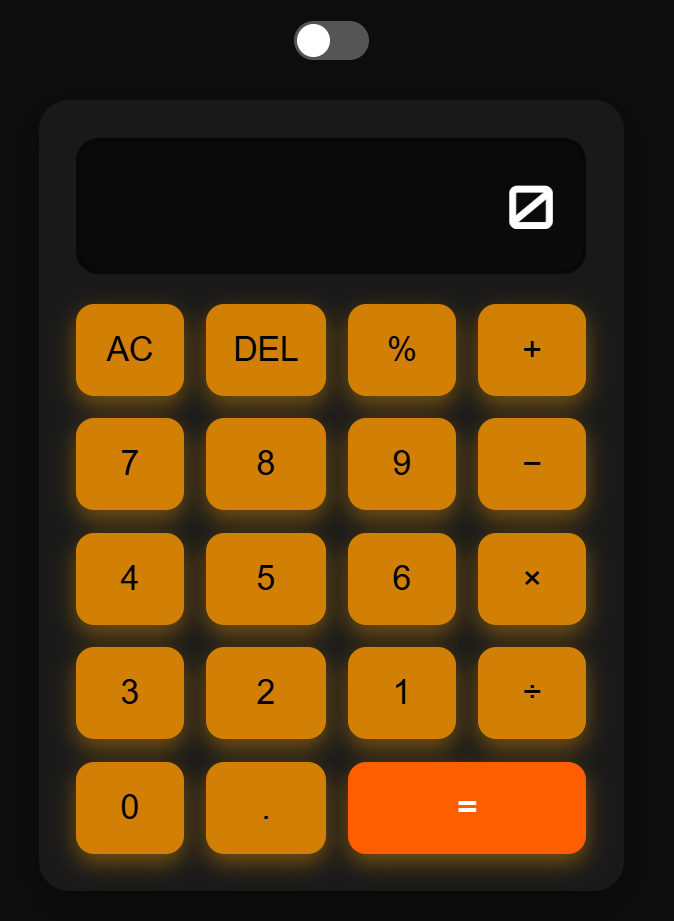

# ⚡ Fancy Web Calculator

A fully responsive, modern calculator with a **dark/light mode toggle**, **glassmorphism UI**, and **sleek animated buttons** — built with HTML, CSS, and JavaScript.

## 🎨 Features

- 🧮 Basic operations: `+`, `-`, `×`, `÷`, `%`
- 🔄 Clear (`AC`) and delete (`DEL`) functions
- 🌙 Light/Dark mode toggle with animated switch
- 💎 Fancy UI with blur effects, shadows & neon glow
- 🔥 Responsive on desktop and mobile

## 🖼️ Preview



## 🚀 Live Demo

> [Try it now on GitHub Pages](https://leisha060105.github.io/calculator-app/)

## 📁 How to Use

1. Clone or download:
```bash
git clone https://github.com/leisha010605/calculator-app.git
